# Reusing a Sony HCD-MJ1 Vacuum Fluorescent Display with Raspberry-Pi Pico and MicroPython

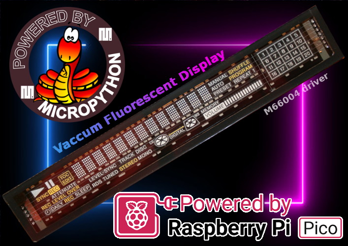

The Sony HCD-MJ1 is a CD + MiniDisc player including a amplifier.
As shown on the model here below, this device also includes a Vacuum Fluorescent Display also named VFD.
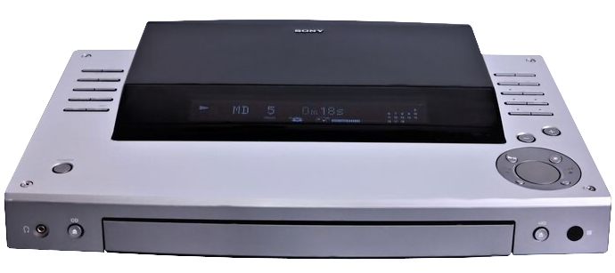

This device was out-of-order so I decided to salvage components from it. 

Among the salvaged parts, there is the VFD display offering lot of parts to illuminates.

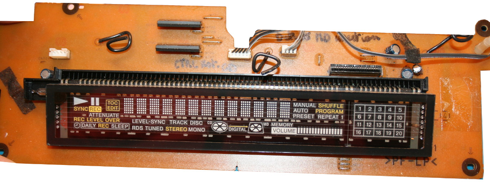

This page gives details of re-using the VFD drived by a M66004 driver together with a Raspberry-Pi Pico.

# About the Vaccum Fluorescent Display
It is important to understand how the VFD work before starting some hacking around it.

The VFD is made as follow (see the two pictured below):

1. A filament which is heated enough to increase activity in its metal to produce free electron. Note: the filament does not appears red to human eyes because it is not hot enough for that.
2. The filament is maintain at a negative voltage (usually less than -10V).
3. The grid in the middle is set to more positive voltage than the filament. GND (0V) being more positive than filament voltage, the electron fly from filament to the grid. Some electron are captured by the grid but many electron pass through the holes (so toward the segments).
4. __For multiple digits setup__: each digit is fitted with its own grid. So unused digit do not have any voltage applied to its grid. Electron will not fly toward the grid and the digit segments. As a consequence, that digit will not light on any segment.
5. The segments with a positive voltage (more positive than filament) will capture the moving electrons. Segments at GND voltage will be hit by electrons and will emit fluorescent light in reaction.
6. Segments with negative voltage (at least as negative as the filament) will not attract electron. A more negative voltage than filament will even repel electrons from the segment.

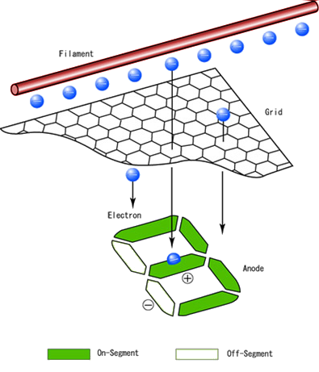

Image source: [this page on Futaba corporation](https://www.futaba.co.jp/en/product/vfd)


Image Source: [This page on TubeClickDB.com](https://www.tubeclockdb.com/vfd-tubes/100-simple-vfd-tester.html)

__Ressources:__

* [Vacuum fluorescent display](docs/Vacuum-fluorescent-display-Wikipedia.pdf) : a great introduction by WikiPedia (pdf, Wikipedia)
* [How a VFD works, wiring and testing](https://youtu.be/WgvuGIWm3zQ?si=Rh3ptZniJlTqDWhn) : a very instructive YouTube video.
* [___M66004-datasheet___](docs/M66004-datasheet.pdf) : the driver used on this VFD. Also contains the command and useful informations.

# The HCD-MJ1 Vaccum Fluorescent Display
Here the back of the board with useful informations
.jpg)
By using the [M66004 datasheet](docs/M66004-datasheet.pdf), the heater circuitery have been retro-ingineered as follow:

.jpg)

* The M66004 application example helped to figure out the VP voltage.
* The bias voltage was mesured on the board
* The initial heater voltage was set to 3V (based on the video [How a VFD works, wiring and testing](https://youtu.be/WgvuGIWm3zQ?si=Rh3ptZniJlTqDWhn) )
* Later, the ALL_DIGIT_DISPLAY command with ON did allowed to me to tune the heater voltage to 4.5V (as the heater made 10 Ohms, we have a current of 450mA).

By reporting the collected information on the M66004 application example, we do obtains the following schematic.

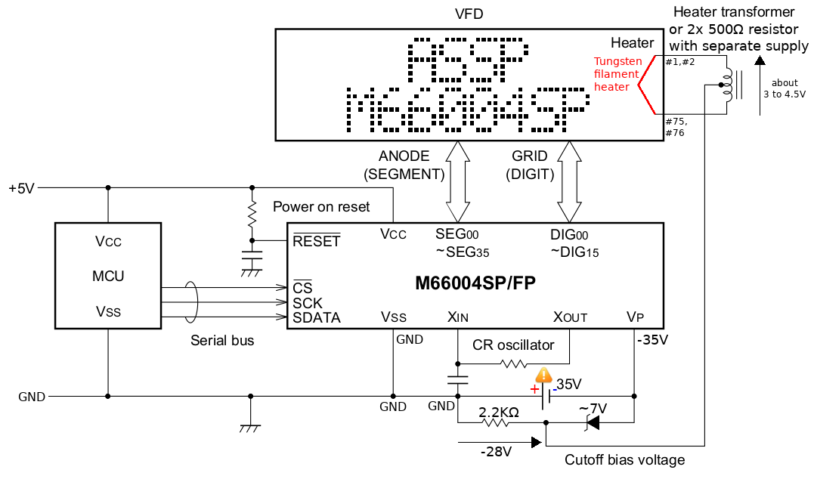

The setup have been tested with a VP=-32.5V as my desk lab supply can't go higher.

The picture below reports the various filament, grid, segment voltages on a single digit.

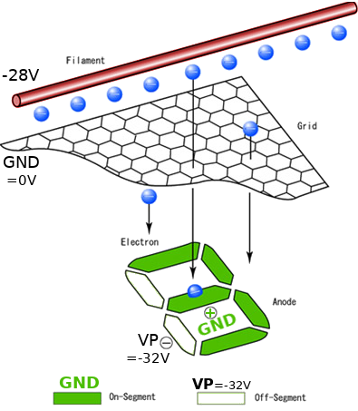

Finally the display connector is decifered and labelled as follow:

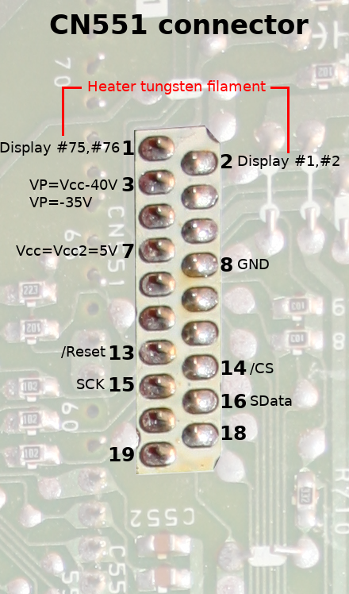

The M66004 VFD driver is a 5V Logic chip!

* __Pin 1 & 2__: Heater supply voltage. Experience demontrated a minimum of 3V and great result with 4 to 4.5V.
* __Pin 3__: The VP source voltage for the M66004. Should be -35 (work fine with 32.5V)
* __Pin 7__: Logic voltage of 5V.
* __Pin 8__: Common ground reference.
* __Pin 13__: Set it low to Reset the M66004. Pin13 is connected to MC66004 via 1KΩ resistor. Pin13 is also fitted with a pull-down resistor of 700Ω.
* __Pin 14__: Set is low tp communicate with the M66004 chip.
* __Pin 15__: Clock for sending a bit to M66004. Data is acquired by chip on rising edge.
* __Pin 16__: Serial Data for sending bits to the M66004 (MSB first).

# Digits localisation
Digit 1 to 13 are used to display characters (see 5x7 segments character code list in the [M66004 datasheet](docs/M66004-datasheet.pdf)).

.jpg)
Each digit is made of 35 segments (or pixels) allowing to draw the char.

The digits #14, #15, #16 are used to cpntrol graphical parts, each graphical/symbol parts being attached to one of the 35 segments of the digit.

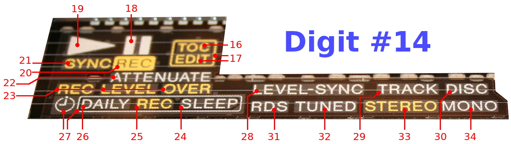

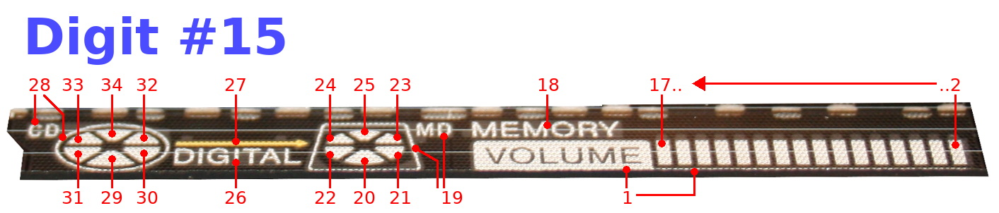

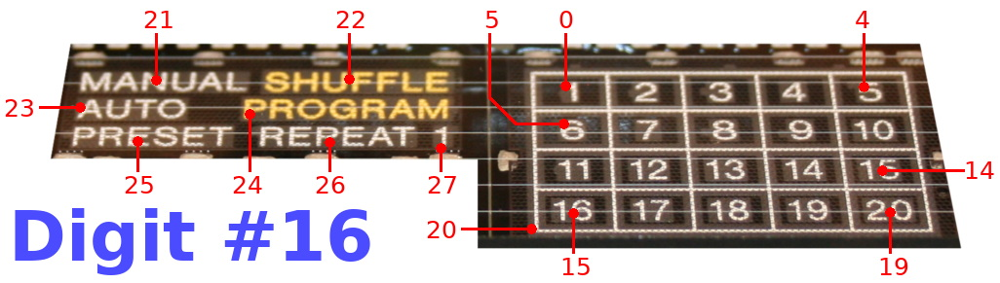

# Wiring to Raspberry-Pi Pico
Here how the VFD board is wired to a [Raspberry-Pi Pico](https://shop.mchobby.be/fr/pico-rp2x/2025-pico-rp2040-microcontroleur-2-coeurs-raspberry-pi-3232100020252.html).
The setup use a common ground for Logic and VP voltages. The heater is wired to an isolated power supply (since it must be shifted relative to VP=-35V).

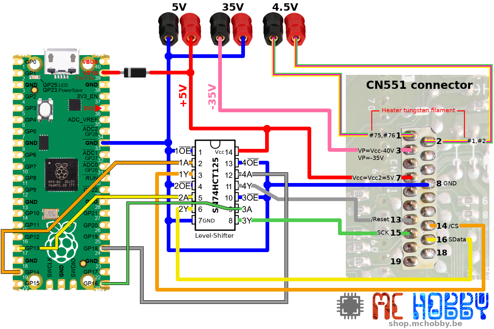

# Library
## vfd_m66 generic library
The library [lib/vfd_m66.py](lib/vfd_m66.py) is a generic library to handle the M66004 driver chipset. 

It allows to:

1. draw ROM char into one of the display digits (from 1 to 16). 
2. define CUSTOM CHAR into the RAM (for reserved char from RAM1 to RAM16).
3. manipulate --on the fly-- each segments (from 0 to 34) of a CUSTOM CHAR.

# Generic examples

Generic examples are based on thr [lib/vfd_m66.py](lib/vfd_m66.py) generic library.

## Display All
The first example written for this setup was [test_display_all.py]() which light up all the segments of the display. It is a good starting point to test the power connexion + bus communication.

The example declare a length of 16 digits. Some of them are real digits showing chars while other are wired to disc/volume/play/etc symbols.

``` python
from machine import Pin
from vfd_m66 import VFD_M6604

_reset = Pin(Pin.board.GP18, Pin.OUT, value=True ) # Unactive
_cs = Pin( Pin.board.GP14, Pin.OUT, value=True ) # unactiva
_sdata = Pin( Pin.board.GP13, Pin.OUT )
_sck = Pin( Pin.board.GP16, Pin.OUT, value=True )

vfd =VFD_M6604( sck=_sck, sdata=_sdata, cs=_cs, reset=_reset )
vfd.digit_length( 16 )
vfd.all_digit_on( )
```

Once executed the display should activate all the segment as shown on the picture here below. The picture was taken without flash, so the picture is a bit blurry.
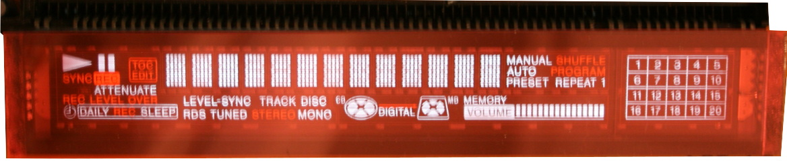

## Print a string
To display a string, we have to the set the position of the initial char to write then sending the binary data with the ASCII code of the characters to be displayed (those are binary data with ordinal value of the character to print. in ASCII "A"" equal 65).

If the auto-increment is set up then all following chars will also be displayed.

``` python
from machine import Pin
from vfd_m66 import VFD_M6604
VFD_LEN = 16  # Nbr of Digits in the display

_reset = Pin(Pin.board.GP18, Pin.OUT, value=True ) # Unactive
_cs = Pin( Pin.board.GP14, Pin.OUT, value=True ) # unactiva
_sdata = Pin( Pin.board.GP13, Pin.OUT )
_sck = Pin( Pin.board.GP16, Pin.OUT, value=True )

vfd =VFD_M6604( sck=_sck, sdata=_sdata, cs=_cs, reset=_reset )
vfd.digit_length( VFD_LEN )

s = "Hello World!"
vfd.display_digit(1, True) # print for position 1 with auto_increment
vfd.send( s.encode('ascii') )
```

Notice that `s.encode('ascii')` do generate a bytes type (a binary array).

## Define a custom character
The characters RAM1 to RAM16 are reserved to create custom 5x7 pixel characters. 
Caracter are defined with a list of 7 entry (1 by line from top to bottom), each entry being a 5bit binary value for the pixels of each file.
The example [test_custom_char.py](examples/test_custom_char.py) demonstrate own to create a custom character (a heart) and own to display it.


``` python
from machine import Pin
from vfd_m66 import VFD_M6604, RAM1
VFD_LEN = 16

_reset = Pin(Pin.board.GP18, Pin.OUT, value=True ) # Unactive
_cs = Pin( Pin.board.GP14, Pin.OUT, value=True ) # unactiva
_sdata = Pin( Pin.board.GP13, Pin.OUT )
_sck = Pin( Pin.board.GP16, Pin.OUT, value=True )

vfd =VFD_M6604( sck=_sck, sdata=_sdata, cs=_cs, reset=_reset )
vfd.digit_length( VFD_LEN )
vfd.normal_operation()

# We can define 5x7 custom char from RAM1 to RAM16
vfd.define_char( RAM1,
	  [ 0b00000,
		0b01010,
		0b10101,
		0b10001,
		0b01010,
		0b00100,
		0b00000 ] )

vfd.display_digit( 1, True ) # Set position from 1th digit with auto-increment
vfd.send( bytes( [ RAM1, RAM1, RAM1 ] ))  # send null chars
```

To display a custom char, we just send its char code in a bytes type.

## Controling symbols
With the M66004, any character is drawed with 35 pixels arranged into a grid of 7 lines of 5 point each. Those 35 pixels are called "VFD segments" and are numbered from 0 to 34.

Instead of drawing a character with a given digit, the segments of that particular digit can be routed to various symbols instead of pixels. 

So, each digit can control up to 34 symbols.


Such digit are controled with a RAM defined characters where the user code turn on/off the segments (attached to the symbols to be controled).

The following example light up the CD, LD cage as well as the digital sign and the arrow above.

``` python

from machine import Pin
from vfd_m66 import VFD_M6604, DigitSegments, RAM15
import time

VFD_LEN = 16  # Nbr of Digits in the display


_reset = Pin(Pin.board.GP18, Pin.OUT, value=True ) # Unactive
_cs = Pin( Pin.board.GP14, Pin.OUT, value=True ) # unactiva
_sdata = Pin( Pin.board.GP13, Pin.OUT )
_sck = Pin( Pin.board.GP16, Pin.OUT, value=True )

vfd =VFD_M6604( sck=_sck, sdata=_sdata, cs=_cs, reset=_reset )
vfd.digit_length( VFD_LEN )

d15 = vfd.attach_digit( digit_idx=15, ram_idx=RAM15 )
d15.set( 28, True )
d15.set( 19, True )
d15.set( 26, True )
d15.set( 27, True )
d15.update()

```